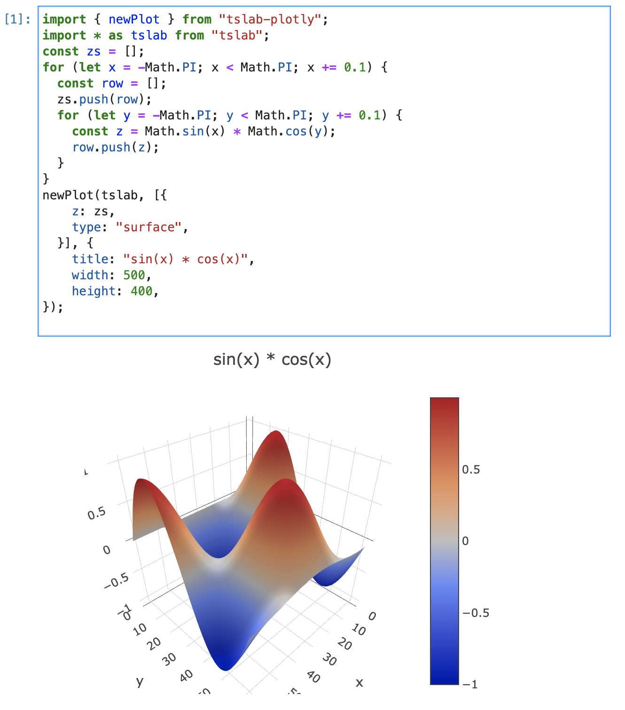

# tslab-plotly

## installation

`npm i tslab-plotly`

Plotly.js plots in typescript Jupyter Notebooks!
Also works in [Notebooks inside VSCode](https://code.visualstudio.com/docs/datascience/jupyter-notebooks).



## Requirements

Obviously node, npm and typescript.

#### Option 1

- [Jupyter lab](https://jupyterlab.readthedocs.io/en/stable/getting_started/installation.html)
- [TSLab](https://github.com/yunabe/tslab)

#### Option 2

- [vscode](https://code.visualstudio.com/)
- [typescript-notebook extension](https://github.com/DonJayamanne/typescript-notebook)

#### Option 3

- [Jupyter lab](https://jupyterlab.readthedocs.io/en/stable/getting_started/installation.html)
- [TSLab](https://github.com/yunabe/tslab)
- [vscode](https://code.visualstudio.com/)
- [vscode-jupyter extension](https://github.com/Microsoft/vscode-jupyter)

## Usage

1. Run `npm i tslab-plotly` in the folder containing your notebook
2. Plot your plots. E.g:

```typescript
import Plotly from "tslab-plot";
import * as tslab from "tslab";

Plotly.newPlot(tslab, [
  {
    x: [1, 2, 3, 4, 5],
    y: [1, 2, 4, 8, 16],
  },
]);
```

## API

The API exposed is exactly the same as that of [plotly.js](https://plotly.com/javascript/), except that the first argument is `tslab` instead of the id of the HTML container element.

See example plots in [https://plotly.com/javascript/](https://plotly.com/javascript/).

## How it works

This library uses tslab.display.html to inject:

- The DIV container for the plot
- A script tag that fetches plotly.js from a CDN
- Passess all the plot parameters to it in JSON format.
